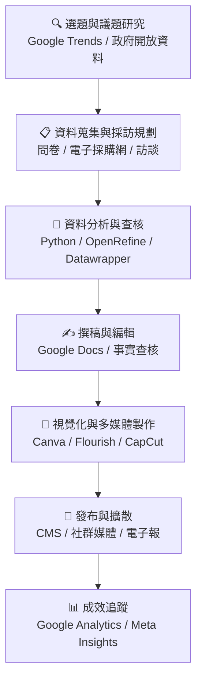
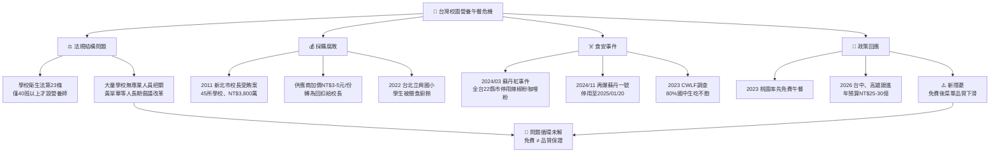

# Mermaid 流程圖

## 圖一：新聞製作 Pipeline

```mermaid
flowchart TD
    A[🔍 選題與議題研究\nGoogle Trends / 政府開放資料] 
    --> B[📋 資料蒐集與採訪規劃\n問卷 / 電子採購網 / 訪談]
    --> C[🔬 資料分析與查核\nPython / OpenRefine / Datawrapper]
    --> D[✍️ 撰稿與編輯\nGoogle Docs / 事實查核]
    --> E[🎨 視覺化與多媒體製作\nCanva / Flourish / CapCut]
    --> F[📢 發布與擴散\nCMS / 社群媒體 / 電子報]
    --> G[📊 成效追蹤\nGoogle Analytics / Meta Insights]
```

---

## 圖二：營養午餐問題結構圖

```mermaid
flowchart TD
    ROOT[🍱 台灣校園營養午餐危機]

    ROOT --> A[⚖️ 法規結構問題]
    ROOT --> B[💰 採購腐敗]
    ROOT --> C[☠️ 食安事件]
    ROOT --> D[📣 政策回應]

    A --> A1[學校衛生法第23條\n僅40班以上才設營養師]
    A --> A2[大量學校無專業人員把關\n黃翠華等人長期倡議改革]

    B --> B1[2011 新北市校長受賄案\n45所學校、NT$3,800萬]
    B --> B2[供應商加價NT$3-5元/份\n轉為回扣給校長]
    B --> B3[2022 台北立興國小\n學生被餵食廚餘]

    C --> C1[2024/03 蘇丹紅事件\n全台22縣市停用辣椒粉咖哩粉]
    C --> C2[2024/11 再爆蘇丹一號\n停用至2025/01/20]
    C --> C3[2023 CWLF調查\n80%國中生吃不飽]

    D --> D1[2023 桃園率先免費午餐]
    D --> D2[2026 台中、高雄跟進\n年預算NT$25-30億]
    D --> D3[⚠️ 新隱憂\n免費後菜單品質下滑]

    D3 --> CRISIS[🔄 問題循環未解\n免費 ≠ 品質保證]
    A2 --> CRISIS
```
