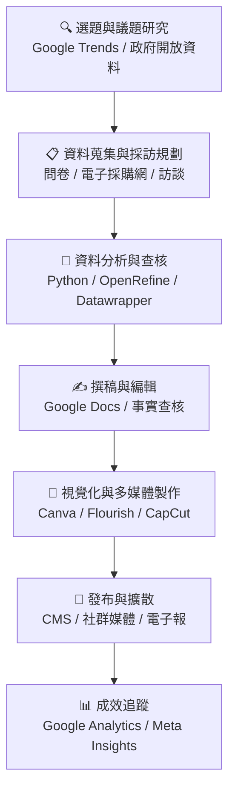
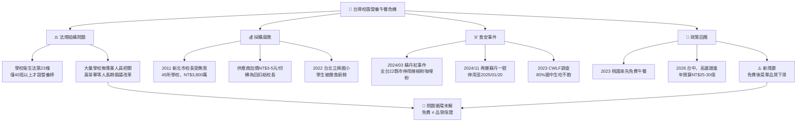

# 🍱 營養午餐之亂——新聞企劃完整素材

> 課堂報告｜新聞實作練習｜2026/06/09

---

## 專案說明

本專案以「台灣校園營養午餐問題」為報導主題，完整模擬一個新聞企劃從選題到發布的製作流程。內容涵蓋選題規劃、資料研究、新聞撰稿、視覺化圖表與製作反思。

---

## 檔案結構

| 檔案 | 內容說明 |
|------|---------|
| `01_pipeline.md` | 六步驟新聞製作流程與每步驟建議工具 |
| `02_research.md` | 關鍵事實（含來源）、可查核 claim、人物/時間/地點清單 |
| `03_news_article.md` | 300-500 字新聞稿正文，含標題、引述、段落結構 |
| `04_mermaid_charts.md` | 兩張 Mermaid 視覺化流程圖 |
| `05_topic_rationale.md` | 選題說明——為什麼選這個主題 |
| `06_reflection.md` | 製作反思：做了什麼、遇到什麼困難、成果總結 |

---

## 核心議題

台灣學校營養午餐問題牽涉四個層面：

- ⚖️ **法規漏洞**：《學校衛生法》第 23 條僅要求 40 班以上學校設置營養師
- 💰 **採購腐敗**：2011 年新北市校長受賄案，45 所學校涉案，金額逾 NT$3,800 萬
- ☠️ **食安危機**：2024 年兩度爆發蘇丹紅染料事件，全台停用辣椒粉、咖哩粉
- 📣 **政策隱憂**：台中、高雄 2026 年推免費午餐，但「免費不等於品質保證」

---

## 關鍵數據

- **80%** 國中生在學校午餐時吃不飽（兒童福利聯盟基金會，2023）
- **45** 所新北市學校涉及校長受賄（2011）
- **22** 縣市同步停用辣椒粉（2024/03 蘇丹紅事件）
- **NT$25-30 億** 台中市免費午餐年預算（2026）

---

## 流程圖

### 新聞製作 Pipeline

### 營養午餐問題結構圖

---

## 資料來源

- [兒童福利聯盟基金會 2023 調查報告](https://www.children.org.tw/english/news_detail/2023_School_Lunches)
- [Taipei Times](https://www.taipeitimes.com)
- [Focus Taiwan / CNA](https://focustaiwan.tw)
- [The News Lens International](https://international.thenewslens.com)
